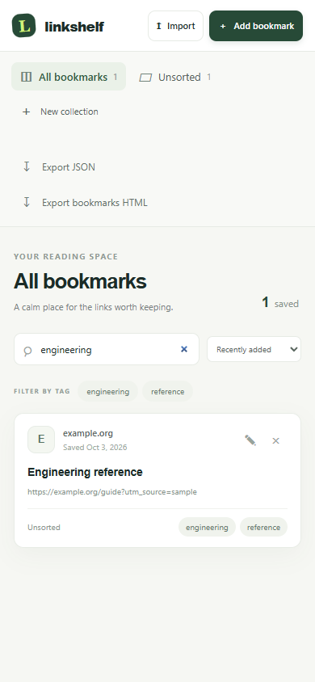

# LinkShelf

[](https://github.com/Saddidly/linkshelf/actions/workflows/ci.yml)

LinkShelf is a local-first bookmark shelf for people who want their saved links to stay searchable and under their control. Save links into collections, add tags, search across titles and addresses, and move your library between browsers with bookmark HTML or JSON.

## What it does

- Saves and edits HTTP or HTTPS bookmarks in browser IndexedDB. Nothing is uploaded to a LinkShelf service, and a fresh install starts empty.
- Organizes links into named collections and tags. Removing a collection moves its links to **Unsorted**.
- Searches bookmark titles, URLs, and tags with quoted phrases, field filters, and exclusions; filters by tag; and sorts by date, title, or website.
- Selects visible search results for atomic bulk moves and tag additions. Bulk deletion asks for confirmation.
- Imports Netscape bookmark HTML (including folder names), LinkShelf JSON backups, Chrome bookmark JSON exports, or a JSON array of `{ "title", "url", "tags", "collectionName" }` records.
- Previews imports, skips normalized URL duplicates, and reports invalid links before saving. Only HTTP and HTTPS links are accepted.
- Exports a versioned JSON backup or Netscape bookmark HTML.

## Run locally

Requires Node.js 22 or newer and npm.

```sh
npm install
npm run dev
```

Open the local URL printed by Vite. To create and serve a production build:

```sh
npm run build
npm run preview
```

The production build is static and can be hosted from any static file server. Keep the site on the same origin when you want to keep using its saved IndexedDB data. Moving to a different origin starts a separate browser database; export a JSON backup first.

## Data and privacy

Bookmarks and collections stay in the browser profile, scoped to the site origin. Clearing site data, using a different browser profile, or opening the app on a different origin can remove or hide the local library. Export a JSON backup before clearing storage or changing origins. Imported URLs are syntax-checked and limited to HTTP(S); LinkShelf does not make background requests to check whether a remote page is reachable.

## Search

Search terms are case-insensitive and combined with AND. Unqualified terms search titles, URLs, and tags. Double quotes keep a phrase together; write `\"` to include a quote inside a phrase. Prefix a term with `tag:`, `collection:`, or `site:` to search that field; quote a field value when it contains spaces. Prefix a term with `-` to exclude matches. For example:

```text
"design systems" tag:research collection:"Reading list" site:example.org -draft
```

`site:` checks for a case-insensitive substring in the saved URL's hostname. It is a convenient search filter, not a security boundary or an exact-domain check. Search does not contact websites. An unknown field, unfinished quote, empty field, or dangling `-` is shown as an error and produces no results until corrected. Search does not support OR expressions.

## Bulk organization

Select individual cards or all results currently visible under the collection, tag, and search filters. Changing one of those filters clears the selection; edits that make a selected bookmark stop matching also remove it from the selection. Move applies to an existing collection, and Add tags appends tags while keeping existing tags. Delete selected opens a confirmation dialog. Each bulk operation is one IndexedDB transaction: if an ID, destination, or tag input is invalid, the complete operation is rejected without partial changes. A bookmark can have up to 20 tags, with each tag limited to 32 characters; a batch tag addition is rejected if it would exceed that limit for any selected bookmark.

## Project layout

- `src/domain.js` contains URL validation, normalized duplicate keys, and tag cleanup.
- `src/search.js` parses and evaluates the documented search grammar.
- `src/transfer.js` parses supported bookmark formats, creates import previews, and writes export formats.
- `src/repository.js` is the IndexedDB persistence boundary.
- `src/main.js` renders the accessible browser UI and connects it to those modules.
- `fixtures/` contains deliberately small files for exercising the import paths; no fixture is loaded into a new library.

See [ARCHITECTURE.md](ARCHITECTURE.md) for storage and import tradeoffs.

## Development

```sh
npm test
npm run build
```

The tests cover URL policy and normalization, duplicate handling, HTML and Chrome JSON parsing, export escaping, search parsing, atomic IndexedDB batch changes, and concurrent mutations. See [CONTRIBUTING.md](CONTRIBUTING.md) for change expectations.

## Preview

Synthetic example data from the local browser check.



## Repeatable browser acceptance

```sh
npx playwright install chromium
npm run test:e2e
```

The tests launch an isolated local server, run desktop and mobile Chromium
contexts, and check actual user flows rather than mocked APIs. Persistent service
data uses a fresh `.playwright-data` location. Failure traces/screenshots are
captured under `test-results`; neither directory belongs in source control.
These checks cover the browser build, not native Android/iOS behavior.
